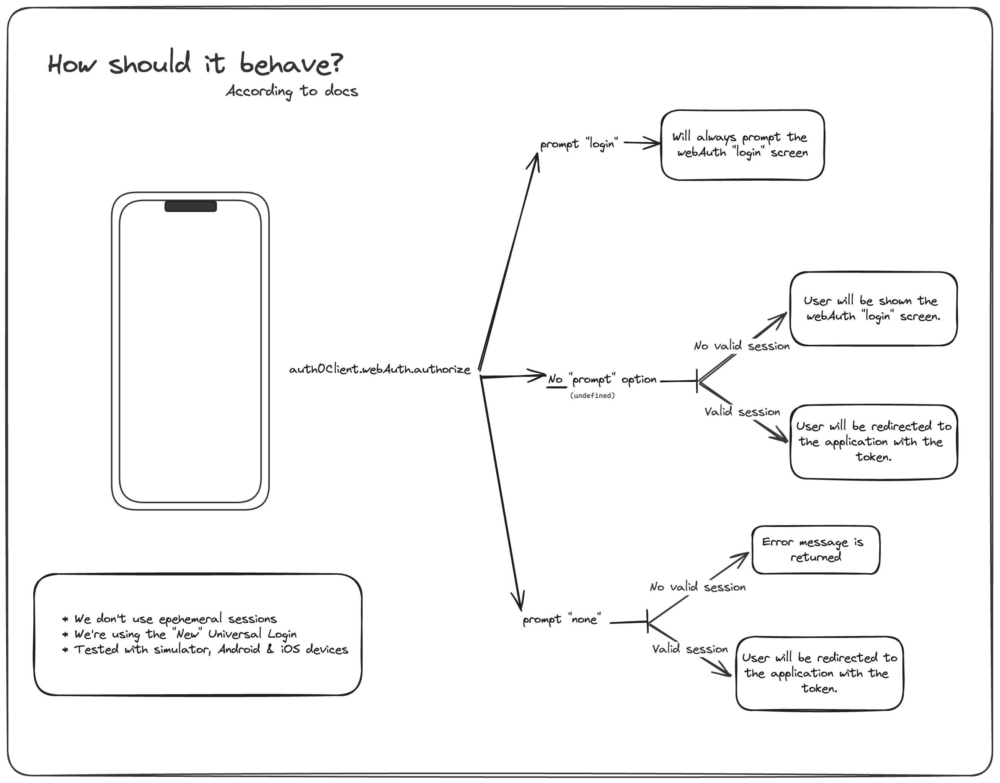

# react-native-auth0 issue

## Description

I'm creating this minimal reproducible example to show the issue I'm facing with the `react-native-auth0` library.

I'm seeing a different behaviour when using the `authorize` function and specifying the `sms` connection.

According to the documentation, in the `authorize` function, `prompt` determines how it will behave:

* If prompt `login` is specified, the user will always be prompted for credentials.
* If prompt `none` is specified, the user won't be prompted, and attempt to login silently. If there's no valid session, it will fail.
* If prompt is not specified (`undefined`), the user will be prompted for credentials only if there's no valid session.

Here's a diagram: 

The issue I'm facing is when expecting the described behaviour when passing also a `connection` value, in this case, `sms`.
When using `authorize` with `sms`, and not specifying a `prompt` value, the user is always prompted for credentials, even if there's a valid session.

## How to run project

* Clone this repository
* Make sure to set the `EXPO_PUBLIC_AUTH0_DOMAIN` and `EXPO_PUBLIC_AUTH0_CLIENT_ID` values in the `.env` file
* Make sure to setup the auth0 application with the correct Callback and Logout URLs given the `bundleIdentifier` and `packageName` values (`app.config.ts`)
* Run `yarn` to install dependencies
* Run `yarn prebuild` to generate the native code
* Run `yarn ios` or `yarn android` to run the project

## Steps to reproduce

* Run the project.
* Click on the `Login (SMS)` button.
* Login with your credentials.
* Click again on the `Login (SMS)` button.
* You will be prompted to login again, even if there's a valid session.

If you try the same behaviour with the `Login` button, you will see that the user is not prompted to login again, as expected.
